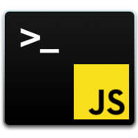

# jsSuperInit

## About

This little tool help to create a new JS/ES project by adding/creating needed files, deps and configs.

## Settings overview

```shell
Usage : jsSuperInit [options]

 -i : create .gitignore and .stignore files
 -n : npm init
 -b : create boilerplate HTML template (and deps from other options below)
 -e : install/configure eslint/prettier + AirBnB config
 -p : install/configure webcomponents polyfil for Firefox
 -m : install/configure Materialize CSS framework
 -j : install/configure jquery
 -r : install/configure normalize.css CSS framework
 -w : install/configure webpack
 -h : show help & informations
 -H : show some usage examples
 -v : show app version
```

## Usage examples

Only create .gitignore file (current directory)

```shell
jsSuperInit.sh -i
```

Create a new JS project + .gitignore file

```shell
jsSuperInit.sh -in
```

Create a new JS project + .gitignore file + eslint + prettier + webpack + materialize + HTML boilerplate

```shell
jsSuperInit.sh -inbemw
```

Create a simple project + .gitignore + jQuery + HTML boilerplate

```shell
jsSuperInit.sh -inbj
```

## Requirements

### jq

Ubuntu 16.04/18.04 - Linux Mint 18.x/19.x

```shell
sudo apt-get install jq
```

See https://stedolan.github.io/jq/ for other distros

## Install

```shell
git clone https://github.com/shakasan/jsSuperInit.git
cd jsSuperInit/
chmod +x jsSuperInit
sudo cp jsSuperInit /usr/local/bin/
```

## TODO

- [ ] Check and install VSCode extensions and needed settings if necessary ?
- [ ] Susy v3 ?
- [ ] Bootstrap ?
- [ ] angular, angular/cli ?
- [ ] suggestions ?

## Release notes

- 2018-07-08 : initial release

## Credits

This script has been written by Francois B. (Makotosan)

- Email : francois@makotonoblog.be
- Website : https://makotonoblog.be/

## Licence

The script is licensed under the terms of the GPLv3
